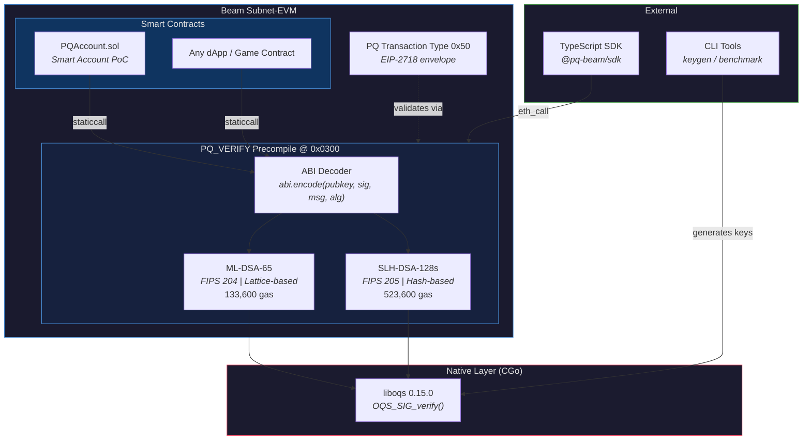
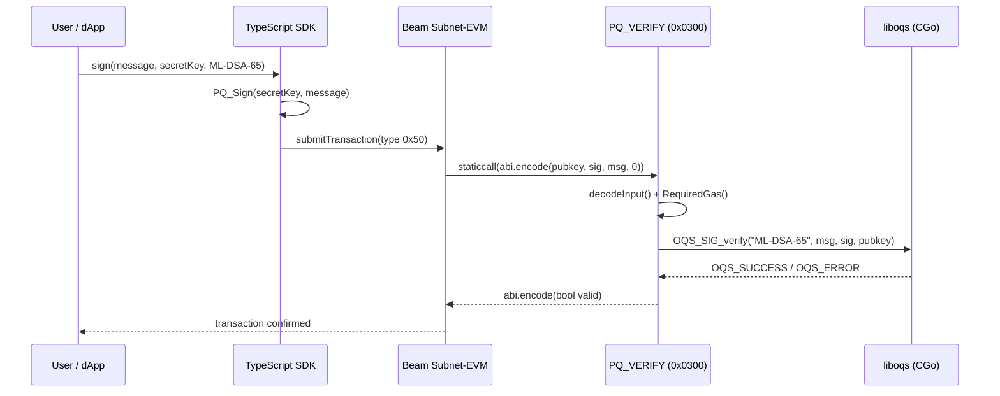
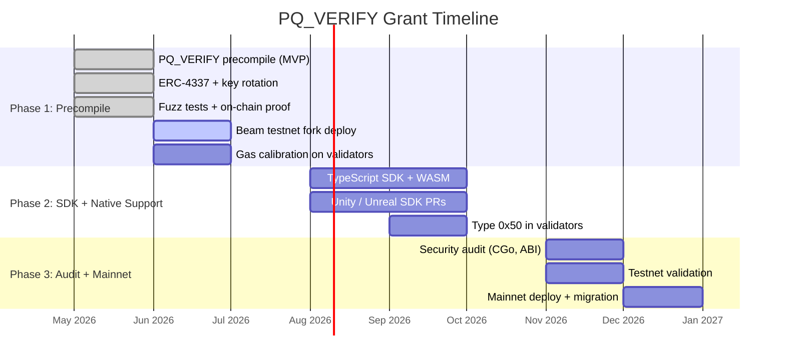

# PQ_VERIFY

**Native post-quantum signature verification precompile for the Beam Network.**

Adds on-chain verification of [ML-DSA-65](https://csrc.nist.gov/pubs/fips/204/final) (Dilithium, NIST FIPS 204) and [SLH-DSA-128s](https://csrc.nist.gov/pubs/fips/205/final) (SPHINCS+, NIST FIPS 205) signatures to Beam's Subnet-EVM, preparing the network for the post-quantum era.

Built for the [Beam Foundation Grant](https://www.onbeam.com/) &mdash; Post-Quantum Signing Infrastructure.

---

## Why Post-Quantum?

Quantum computers running Shor's algorithm will break ECDSA, the signature scheme securing every Ethereum-compatible blockchain today. On Beam, this means **$4.1B+ in staked assets, validator keys, bridge BLS keys, gaming wallets, and governance** are all protected by cryptography that has a known expiration date. NIST finalized post-quantum standards in August 2024 and mandates federal migration by 2030-2035.

- **Validator keys are the highest-value target** &mdash; compromised validators mean compromised block production and consensus.
- **Key migration is slow** and must begin before quantum computers are cryptographically relevant (projected 10-15 years).
- **Beam is positioned to lead** &mdash; as a Subnet-EVM chain, deploying a custom precompile is significantly simpler than on Ethereum mainnet. No hard fork politics, no years of EIPs.

PQ_VERIFY is the first step: a stateless, gas-metered precompile that lets any smart contract &mdash; and eventually validators themselves &mdash; verify post-quantum signatures natively.

---

## Architecture



### Data Flow



### Migration Path


---

## Quick Start

### Prerequisites

| Dependency | Version | Install |
|------------|---------|---------|
| Go | 1.23+ | [golang.org](https://go.dev/dl/) |
| liboqs | 0.15.0+ | `brew install liboqs` (macOS) |
| OpenSSL | 3.x | Usually pre-installed |

### macOS

```bash
brew install liboqs go

git clone https://github.com/SAHU-01/pq-beam-verify-precompile.git
cd verify-precompile

# Run all tests
CGO_ENABLED=1 go test ./... -v

# Run benchmarks
CGO_ENABLED=1 go test ./cmd/benchmark/ -bench=. -benchmem

# Generate a PQ keypair and verify round-trip
CGO_ENABLED=1 go run ./cmd/keygen/ -- --algorithm ml-dsa-65 --verify
```

### Linux (Ubuntu/Debian)

```bash
# Build liboqs from source
sudo apt-get install -y cmake ninja-build libssl-dev
git clone --depth 1 --branch 0.15.0 https://github.com/open-quantum-safe/liboqs.git
cd liboqs && mkdir build && cd build
cmake -GNinja -DCMAKE_INSTALL_PREFIX=/usr/local ..
ninja && sudo ninja install && sudo ldconfig

# Clone and test
git clone https://github.com/SAHU-01/pq-beam-verify-precompile.git
cd verify-precompile
CGO_ENABLED=1 \
  CGO_CFLAGS="-I/usr/local/include" \
  CGO_LDFLAGS="-L/usr/local/lib -loqs -lcrypto" \
  go test ./... -v
```

---

## Benchmark Results

Measured on Apple M1 Pro, 1000 iterations. Reproduce via `cmd/benchmark/`.

| Operation | Avg Time | Ops/sec | Memory |
|-----------|----------|---------|--------|
| ML-DSA-65 verify | 105 us | 9,504 | 0 B/op |
| ML-DSA-65 sign | 497 us | 2,013 | 3,488 B/op |
| SLH-DSA-128s verify | 432 us | 2,316 | 0 B/op |
| SLH-DSA-128s sign | 439 ms | 2.3 | 8,224 B/op |
| SHA256+Keccak (baseline) | 0.5 us | 2,051,636 | 32 B/op |

ML-DSA-65 verification is **~4.2x slower than ecrecover** &mdash; well within Beam's 4,500 TPS throughput.

---

## Gas Schedule

| Algorithm | Base | Verify | Total | Rationale |
|-----------|------|--------|-------|-----------|
| ML-DSA-65 | 3,600 | 130,000 | 133,600 | 4.2x ecrecover, 10x safety margin |
| SLH-DSA-128s | 3,600 | 520,000 | 523,600 | 17.3x ecrecover, 10x safety margin |

Gas costs scale proportionally to benchmark times with a consistent 10x safety margin for validator hardware variance. SLH-DSA-128s correctly costs more because it is the slower algorithm. Costs are configurable per-chain via genesis `gasOverrides` and will be calibrated on Beam validator hardware before mainnet.

---

## Key & Signature Sizes

| Algorithm | Standard | Public Key | Secret Key | Signature | Security |
|-----------|----------|-----------|------------|-----------|----------|
| ML-DSA-65 | FIPS 204 | 1,952 B | 4,032 B | 3,309 B | NIST Level 3 (AES-192) |
| SLH-DSA-128s | FIPS 205 | 32 B | 64 B | 7,856 B | NIST Level 1 (AES-128) |

ML-DSA-65 is the recommended primary algorithm (compact signatures, fast verification). SLH-DSA-128s is the conservative hash-based fallback with minimal cryptographic assumptions.

---

## Solidity Usage

Call the precompile directly from any smart contract:

```solidity
address constant PQ_VERIFY = address(0x0300);

(bool success, bytes memory result) = PQ_VERIFY.staticcall(
    abi.encode(pubkey, signature, message, algorithm)
);
bool valid = abi.decode(result, (bool));
```

Or use the typed interface:

```solidity
import "./IPQVerify.sol";

IPQVerify pqVerify = IPQVerify(address(0x0300));
bool valid = pqVerify.pqVerify(pubkey, signature, message, 0); // 0 = ML-DSA-65
```

See [`contracts/PQAccount.sol`](contracts/PQAccount.sol) for a full smart account proof-of-concept with nonce-based replay protection and arbitrary execution.

---

## PQ Transaction Type (0x50)

New [EIP-2718](https://eips.ethereum.org/EIPS/eip-2718) typed transaction replacing ECDSA `v, r, s` with PQ fields:

```
0x50 || RLP([chainId, nonce, gasPrice, gasLimit, to, value, data,
             pqAlgorithm, pqPublicKey, pqSignature])
```

- **Replay protection**: Signing hash includes chain ID and the 0x50 type prefix.
- **Address derivation**: `keccak256(pqPublicKey)[12:32]` &mdash; identical to ECDSA, ensuring wallet/explorer compatibility.
- **Backward compatible**: ECDSA transactions continue to work unchanged.

See [`docs/TECHNICAL_SPEC.md`](docs/TECHNICAL_SPEC.md) for the full specification.

---

## Local Deployment

Deploy PQ_VERIFY on a local Avalanche subnet in one command:

```bash
./scripts/deploy_local.sh
```

Or follow the manual steps in **[`docs/LOCAL_DEPLOYMENT.md`](docs/LOCAL_DEPLOYMENT.md)**, which covers:

- Building the custom Subnet-EVM binary with CGo/liboqs
- Building a matching AvalancheGo binary (required -- the CLI's default binary is incompatible; see the guide for why)
- Creating and deploying the blockchain
- Known pitfalls (version mismatch, disk space, address discrepancies)
- Production integration path for Beam's architecture

### On-Chain Demo Results (Local Subnet)

The following results are from a local Avalanche subnet running the modified Subnet-EVM with PQ_VERIFY registered at `0x0300000000000000000000000000000000000000`:

| Item | Value |
|------|-------|
| Chain ID | 13337 |
| VM | Subnet-EVM v0.8.0 + PQ_VERIFY |
| Precompile address | `0x0300000000000000000000000000000000000000` |
| PQVerifyTestHelper | `0x52C84043CD9c865236f11d9Fc9F56aa003c1f922` |
| PQAccount | `0x5DB9A7629912EBF95876228C24A848de0bfB43A9` |
| Valid signature TX | `0x5bc2aff8383473be1e9ba070adb2dd8935c961c804f9e74ce0d763a51752febc` |
| Tampered signature TX | `0x9cb8d4f678e360364bdc455f33806933c82ed7d1894bb57ed56b4241a7110907` |
| Block | #2 |
| Gas used (valid tx) | 250,146 |
| Precompile gas | 140,072 |

**Valid signature**: ML-DSA-65 signature over "Hello Beam! Post-quantum signatures are live on-chain." with a 1,952-byte public key and 3,309-byte signature. Precompile returned `true`.

**Tampered signature**: Same pubkey and message, 1 byte flipped in signature. Precompile returned `false`.

> **Note**: These are local subnet results. Public Beam testnet deployment is the next Phase 1 deliverable.

To reproduce: `./scripts/deploy_local.sh` then `./scripts/demo_onchain.sh`

---

## Subnet-EVM Integration

The `subnet-evm/` directory contains the adapter module for integrating PQ_VERIFY into a Subnet-EVM fork. See [`subnet-evm/INTEGRATION.md`](subnet-evm/INTEGRATION.md) for the code-level guide and [`docs/LOCAL_DEPLOYMENT.md`](docs/LOCAL_DEPLOYMENT.md) for the operational guide.

```mermaid
graph LR
    A["1. Fork subnet-evm"] --> B["2. Copy pkg/ into fork"]
    B --> C["3. Register module.go"]
    C --> D["4. Build with CGo"]
    D --> E["5. Build matching AvalancheGo"]
    E --> F["6. Deploy local subnet"]
    F --> G["7. Verify on-chain"]

    style A fill:#264653,stroke:#2a9d8f,color:#e9f5db
    style B fill:#264653,stroke:#2a9d8f,color:#e9f5db
    style C fill:#264653,stroke:#2a9d8f,color:#e9f5db
    style D fill:#264653,stroke:#2a9d8f,color:#e9f5db
    style E fill:#264653,stroke:#e94560,color:#e9f5db
    style F fill:#264653,stroke:#2a9d8f,color:#e9f5db
    style G fill:#264653,stroke:#2a9d8f,color:#e9f5db
```



---

## Project Structure

```
pq-beam-verify-precompile/
|-- pkg/
|   |-- pqcrypto/              CGo bindings to liboqs (ML-DSA-65, SLH-DSA-128s)
|   +-- pqverify/              Precompile implementation
|       |-- precompile.go      PQ_VERIFY Run() + RequiredGas()
|       |-- address.go         PQ address derivation (keccak256)
|       |-- txtype.go          EIP-2718 type 0x50 transaction
|       +-- config.go          Subnet-EVM precompile config + gas overrides
|
|-- subnet-evm/                Subnet-EVM fork integration
|   |-- module.go              StatefulPrecompiledContract adapter
|   |-- registry_snippet.go    Registry import reference
|   +-- INTEGRATION.md         Step-by-step fork/build/deploy guide
|
|-- contracts/
|   |-- IPQVerify.sol          Solidity interface for the precompile
|   |-- PQAccount.sol          ERC-4337 smart account with PQ verification
|   |-- PQKeyRotation.sol      ECDSA→PQ migration + PQ key rotation with timelock
|   +-- PQVerifyTestHelper.sol Test helper with batch verification
|
|-- cmd/
|   |-- benchmark/             Benchmark CLI + Go benchmarks
|   +-- keygen/                PQ keypair generation CLI
|
|-- sdk/                       TypeScript SDK (Phase 2)
|-- test/                      End-to-end integration tests
|-- scripts/                   Genesis config + deploy scripts
|-- docs/                      Technical specification
+-- .github/workflows/         CI pipeline (GitHub Actions)
```

---

## Testing

```bash
# Unit tests (crypto + precompile + tx type)
CGO_ENABLED=1 go test ./pkg/... -v

# End-to-end tests (full keygen -> sign -> verify flow)
CGO_ENABLED=1 go test ./test/ -v

# Benchmarks
CGO_ENABLED=1 go test ./cmd/benchmark/ -bench=. -benchmem

# Full deploy test (keygen + unit + E2E + benchmarks)
./scripts/deploy_test.sh
```

| Layer | Tests | Coverage |
|-------|-------|----------|
| `pkg/pqcrypto` | 8 | Keygen, sign, verify, tampering, empty messages, cross-algorithm |
| `pkg/pqverify` | 10 + 2 fuzz | ABI encode/decode, gas, valid/invalid sigs, malformed input, `FuzzDecodeInput`, `FuzzPrecompileRun` |
| `test/e2e` | 7 | Full flow, dual algorithm, 1MB message, 50 sequential, address determinism |
| `cmd/benchmark` | 4 | Go benchmark suite for verify + sign, both algorithms |
| Solidity | CI | Compilation check for IPQVerify, PQAccount (ERC-4337), PQKeyRotation |

> **Fuzz testing**: `FuzzDecodeInput` found and fixed an overflow bug in `decodeBytesAt()` where `big.Int.Uint64()` silently overflowed on crafted inputs, causing a validator-crashing panic. Fixed with `safeUint64()` and overflow-safe bounds checks. ~4M fuzz executions clean.

All test data is **ephemeral** &mdash; fresh keypairs generated per test run. No hardcoded keys or canned results.

---

## Milestone Roadmap



---

## Security

- **Stateless precompile**: No storage reads/writes, pure function, no reentrancy risk.
- **Gas-metered**: Costs prevent DoS via expensive verification.
- **NIST-standardized**: Both algorithms are finalized FIPS standards (204/205), not experimental.
- **Dual algorithm strategy**: Hash-based fallback (SLH-DSA-128s) if lattice assumptions are ever broken.
- **Constant-time**: liboqs is designed for constant-time operation. CGo boundary timing will be examined in the Phase 3 security audit.
- **No simulations**: Every cryptographic operation calls liboqs via CGo. All test data is generated fresh per run.

**Planned Phase 3 audit scope:**
- CGo boundary side-channel analysis
- ABI decoder fuzzing with untrusted input
- Gas cost validation on validator hardware
- Smart account authorization flow review

---

## Related Work

- [NIST FIPS 204 &mdash; ML-DSA](https://csrc.nist.gov/pubs/fips/204/final)
- [NIST FIPS 205 &mdash; SLH-DSA](https://csrc.nist.gov/pubs/fips/205/final)
- [Open Quantum Safe &mdash; liboqs](https://github.com/open-quantum-safe/liboqs)
- [EIP-2718 &mdash; Typed Transaction Envelope](https://eips.ethereum.org/EIPS/eip-2718)
- [Subnet-EVM Custom Precompiles](https://docs.avax.network/build/subnet/upgrade/customize-a-subnet#precompiles)
- [Beam SDK Documentation](https://docs.onbeam.com/sdk)

---

## Acknowledgments

- **NIST** for finalizing the post-quantum signature standards (FIPS 204/205).
- **Open Quantum Safe** for the liboqs library providing production-grade PQ implementations.
- **Beam Foundation** for funding post-quantum infrastructure research.
- **Ava Labs** for the Subnet-EVM framework enabling custom precompile deployment.

---

## Contributing

See [`CONTRIBUTING.md`](CONTRIBUTING.md) for development setup, testing, and guidelines for adding new PQ algorithms.

## License

[MIT](LICENSE)
